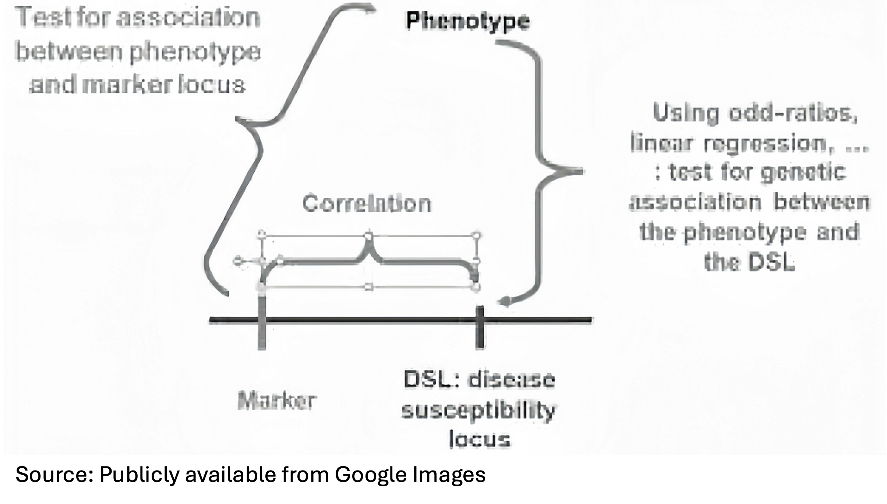

# Association testing I

```
$ echo "Data Sciences Institute"
```

----

# What You’ll Learn Today 

- Set up the regression models or table-based tests and choose appropriate genotype codings.

- Interpret effect sizes, uncertainty, and evidence to make clear claims about variant–trait links.

- Recognize key assumptions, power drivers, and the role of LD so you can judge how much to trust a finding.

----

# Association Testing

- **Objective**: establish association between a trait of interest and a genetic marker.

- Study designs: case-control, case-cohort, population-based design.

- Unrelated subjects or **population-based designs**: easy to collect so possible to achieve large sample sizes as in GWAS.

- **Family-based designs**: robust to population stratification, more difficult to collect. Also hard to collect for late-onset diseases.

---

# Overview

- For **a quantitative trait** $Y$: simple linear regression models to detect association between $Y$ and $G$:

$$
Y=\alpha+\beta G+e, e \sim N\left(0, \sigma^2\right) .
$$

- Coding of G: 1 d.f. additive (or dominant, recessive) model or 2 d.f. genotypic model. 

  | $G=$ | aa | Aa | AA |
  | :---: | :---: | :---: | :---: |
  | Additive | 0 | 1 | 2 |
  | Dominant | 0 | 1 | 1 |
  | Recessive | 0 | 0 | 1 |
  | Genotypic | "0" | "1" | "2" |

---

# Overview

- **1 d.f. model**: $\quad Y=\alpha+\beta G+e, e \sim N\left(0, \sigma^2\right).$
   - The test of no association is equivalent to $H_0: \beta=0$.
   
<br>   
   
- **Genotypic (2 d.f.) model**: $\quad Y=\alpha+\beta_1 D_1+\beta_2 D_2+e, \quad e \sim N(0, \sigma^2).$
  - $D_1=I(G=A a)$, $D_2=I(G=A A)$.
  - $H_0: \beta_1=\beta_2=0$.
  
<br>
   
- **Extended model** (includes environment, other SNPs, interactions):

$$
Y=\alpha+\beta G+\gamma E+\delta G x E+e, e \sim N\left(0, \sigma^2\right) .
$$

---

# Association Analysis for Binary Trait

- For a binary trait $Y$: $Y=1$ denotes for being affected/cases, and $Y=0$ for unaffected/controls
- SNP: categorical variable with three genotypes (Aa, aa and AA)

- Genotype frequency differ between cases and controls only at the DSL or markers that are in LD with the DSL

- How do we detect association between $Y$ and $G$ ?
  - **Compare frequency differences between cases and controls**
  - **Use regression framework** to unify analysis (QTL + binary traits, with covariates and interactions)
---

# Association Testing (2 df test)

- Observed genotype counts at a marker under the study for $r$ cases and $s$ controls.
    |  | aa | Aa | AA | Total |
    | :---: | :---: | :---: | :---: | :---: |
    | Cases | $r_0$ | $r_1$ | $r_2$ | $r$ |
    | Controls | $s_0$ | $s_1$ | $s_2$ | $s$ |
    | Total | $n_0$ | $n_1$ | $n_2$ | $n$ |

- Most general test: nothing is assumed about the relationship between disease and genotype.
$$
\begin{aligned}
& H_0: P(Y=1 \mid A A)=P(Y=1 \mid A a)=P(Y=1 \mid a a) \\
& H_A: \text { At least one inequality holds }
\end{aligned}
$$

----

# Contingency Table - Pearson's Homogeneity Test

- Assume we have independent observations from $I$ multinomial distributions, each of which has $J$ categories, e.g. $I=2$.

  |  | $X=0$ | $X=1$ | $\ldots$ | $X=J-1$ | Total |
  | :---: | :---: | :---: | :---: | :---: | :---: |
  | Cases | $r_0$ | $r_1$ | $\ldots$ | $r_{J-1}$ | $r$ |
  | Controls | $s_0$ | $s_1$ | $\ldots$ | $s_{J-1}$ | $s$ |
   | Total | $n_0$ | $n_1$ | $\ldots$ | $n_{J-1}$ | $n$ |

- Our goal is to test whether the multinomial distributions for the two groups are identical.
$$
H_0: \pi_{1 j}=\pi_{2 j} \equiv \pi_j, \quad j=0,1, \ldots, J-2 .
$$

---


# Pearson's Homogeneity Test


- Test Statistic

$$
T=\sum \frac{(O-E)^2}{E} \sim \chi_{(I-1)(J-1)}^2.
$$

- E：expected counts under the null hypothesis of homogeneity using pooled estimate $\tilde{\pi}_j=\frac{n_j}{n}.$

- df $=(I-1)(J-1)$: number of independent counts $(I(J-1))$ - the number of independent parameters estimated under the null from the data $(J-1)$.

----

# Association Testing (2 df test)

-   |  | aa | Aa | AA | Total |
    | :---: | :---: | :---: | :---: | :---: |
    | Cases | $r_0$ | $r_1$ | $r_2$ | $r$ |
    | Controls | $s_0$ | $s_1$ | $s_2$ | $s$ |
    | Total | $n_0$ | $n_1$ | $n_2$ | $n$ |

- Two df Pearson test of independence:

$$
\chi^2=\sum(O-E)^2 / E.
$$

- Sum is over all six entries. e.g. $\mathrm{E}[$ Case \& aa $]=\left(r \cdot \mathrm{n}_{0}\right) / \mathrm{n}$.

---

# Association Testing (1 df test)

- For example:

|  | aa | Aa | Total |
| :---: | :---: | :---: | :---: |
| Cases | $r_0$ | $r_1$ | $r$ |
| Controls | $s_0$ | $s_1$ | $s$ |
| Total | $n_0$ | $n_1$ | $n$ |


$$
T=\frac{\left(r_0-\frac{r n_0}{n}\right)^2}{\frac{r n_0}{n}}+\frac{\left(r_1-\frac{r n_1}{n}\right)^2}{\frac{r n_1}{n}}+\frac{\left(s_0-\frac{s n_0}{n}\right)^2}{\frac{s n_0}{n}}+\frac{\left(s_1-\frac{s n_1}{n}\right)^2}{\frac{s n_1}{n}} \sim \chi_1^2 .
$$

---

# Association Testing - Dominant model

-
  |  | aa | Aa or AA | Total |
  | :---: | :---: | :---: | :---: |
  | Cases | $r_0$ | $r_1+r_2$ | $r$ |
  | Controls | $s_0$ | $s_1+s_2$ | $s$ |
  | Total | $n_0$ | $n_1+n_2$ | $n$ |

- Dominant model:

$$
\begin{aligned}
& H_0: P(Y=1 \mid A A)=P(Y=1 \mid A a)=P(Y=1 \mid a a) \\
& H_A: P(Y=1 \mid A A \text { or } A a) \neq P(Y=1 \mid a a)
\end{aligned}
$$

- Replace $r_{1}$ with $r_{1}+r_{2}$ with 1 df chi-square test.
- Optimal when the true disease model is dominant but not for recessive.

---

# Exercise 

- Recessive model:

  |  | aa or Aa | AA | Total |
  | :---: | :---: | :---: | :---: |
  | Cases | $r_0+r_1$ | $r_2$ | $r$ |
  | Controls | $s_0+s_1$ | $s_2$ | $s$ |
  | Total | $n_0+n_1$ | $n_2$ | $n$ |


---


# Association Testing - Additive Model 

- We can also test for association using **allele counts**.
- $𝐻_{0}:𝑝_{𝑐𝑎𝑠𝑒𝑠}=𝑝_{𝑐𝑜𝑛𝑡𝑟𝑜𝑙𝑠}$
  |  | a | A | Total |
  | :---: | :---: | :---: | :---: |
  | Cases | $2 r_0+r 1$ | $r_1+2 r_2$ | $2 r$ |
  | Controls | $2 s_0+s_1$ | $s_1+s_2$ | $2 s$ |
  | Total | $n_a$ | $n_A$ | $2 n$ |

- Assumptions: samples are independent both within each group (cases and controls) and between groups. Under this assumption, allele count data can be modeled using two independent binomial distributions.

----

# Estimating Effect Sizes - Risk Ratio (RR)

- A natural measure of effect size is relative risk ratio: $R R=\frac{P(\text { disease } \mid \text { exposed })}{P(\text { disease } \mid \text { unexposed })}.$
- Exposure = genotype; recessive model: AA vs (Aa, aa).
- In **case–control** or **genotype-ascertained samples**, group risks are **distorted**.
- Therefore **RR cannot be validly estimated** from those designs.

----

# Odds Ratio

- Odds Ratio are used to approximate the relative risk (RR) for case-control or case-cohort sampling.

- OR compares odds: $\frac{P(D|E)/(1-P(D|E))}{P(D|\bar{E})/(1-P(D|\bar{E}))}.$


- |               | Disease (+) | Disease (–) | Total |
  |---------------|-------------|-------------|-------|
  | **Exposed**   | a           | b           | a+b   |
  | **Unexposed** | c           | d           | c+d   |

$$
OR = \frac{a/c}{b/d} = \frac{ad}{bc}.
$$

- When the outcome is rare, $\mathrm{OR} \approx \mathrm{RR}$.

----

# Inference of ORs

- $OR = \frac{a/c}{b/d} = \frac{ad}{bc}.$

- Log(OR) approximately normal.

- Variance:  
$$
  \text{Var}[\log(OR)] \approx \frac{1}{a} + \frac{1}{b} + \frac{1}{c} + \frac{1}{d}.
$$
- 95% CI:  
$$
  \exp \left( \log(OR) \pm 1.96 \cdot \sqrt{\text{Var}[\log(OR)]} \right).
$$

----

# Limitations of Previous Tests

- Work well only for simple binary traits without major environmental influence

- Do not easily adjust for covariates (e.g., age, sex, ancestry)

- Population stratification can confound results if unadjusted

- Stratified analyses are one workaround, but not always sufficient

----

<!--

# Properties of log Odds and log OR

- Invariance: If we decide to reverse the roles of the binary outcomes and let $\pi$ be the probability of failure rather than success, then the logit parameter simply changes the sign.

$$
\operatorname{logit}(1-\pi)=-\operatorname{logit}(\pi) .
$$

- Unboundedness: this will come handy in formulating regression model for binary trait.

$$
\operatorname{logit}(\pi)=\log \left(\frac{\pi}{1-\pi}\right) \in(-\infty, \infty) .
$$


- A difficulty with odds: odds ratios are not additive.

- When the risk is small: $\mathrm{OR} \approx \pi_1 / \pi_2$ (relative risk).

- Most importantly: the (log-)odds ratio can be estimated from either retrospective (e.g. case-control) or prospective studies.

$$
\frac{\operatorname{odds}(A \mid B)}{\operatorname{odds}(A \mid \bar{B})}=\frac{\operatorname{odds}(B \mid A)}{\operatorname{odds}(B \mid \bar{A})} .
$$

---
-->

# Properties of OR
 
- Let $\pi_1^*=P(\text { case } \mid A a) \text { and}~ \pi_2^*=P(\text { case } \mid \text { aa })$. 
- Let $\pi_1=P(\text { Aa } \mid \text { case }) \text { and}~ \pi_2=P(\text { Aa } \mid \text { control }).$

- We have the following result that links the two quantities:

$$
\begin{aligned}
\frac{\operatorname{odds}(\text { case } \mid A a)}{\operatorname{odds}(\text { case } \mid a a)} & =\frac{\pi_1^*}{1-\pi_1^*} / \frac{\pi_2^*}{1-\pi_2^*} \\
=\frac{\pi_1}{1-\pi_1} / \frac{\pi_2}{1-\pi_2} & =\frac{\operatorname{odds}(\text { Aa } \mid \text { case })}{\operatorname{odds}(\text { Aa } \mid \text { control })}.
\end{aligned}
$$

----

# Details of the derivation

$$
\begin{gathered}
\frac{\text { odds }(\text { case } \mid A a)}{\text { odds }(\text { case } \mid \text { aa })}=\frac{\pi_1^*}{1-\pi_1^*} / \frac{\pi_2^*}{1-\pi_2^*}=\frac{P(\text { case } \mid A a)}{1-P(\text { case } \mid A a)} / \frac{P(\text { case } \mid a a)}{1-P(\text { case } \mid a a)} \\
=\frac{P(\text { case } \mid A a)}{P(\text { control } \mid A a)} / \frac{P(\text { case } \mid a a)}{P(\text { control } \mid \text { aa })}=\frac{P(\text { case }, A a) P(\text { Aa })}{P(\text { control }, A a) P(A a)} / \frac{P(\text { case }, a a) P(a a)}{P(\text { control, aa }) P(a a)} \\
=\frac{P(\text { case }, A a)}{P(\text { control, } A a)} / \frac{P(\text { case, a })}{P(\text { control, aa })} \\
=\frac{P(\text { Aa } \mid \text { case }) P(\text { case })}{P(\text { Aa } \mid \text { control }) P(\text { control })} / \frac{P(\text { aa } \mid \text { case }) P(\text { case })}{P(\text { aa } \mid \text { control }) P(\text { control })} \\
=\frac{P(\text { Aa } \mid \text { case })}{P(\text { aa } \mid \text { case })} / \frac{P(\text { Aa } \mid \text { control })}{P(\text { aa } \mid \text { control })} \\
=\frac{P(\text { Aa } \mid \text { case })}{1-P(\text { Aa } \mid \text { case })} / \frac{P(\text { Aa } \mid \text { control })}{1-P(\text { aa } \mid \text { control })}=\frac{\pi_1}{1-\pi_1} / \frac{\pi_2}{1-\pi_2}=\frac{\text { odds }(\text { Aa } \mid \text { case })}{\text { odds }(\text { Aa } \mid \text { control })}
\end{gathered}
$$

---

# Regression Framework: Extending to Covariates & Traits

- Use Generalized Linear Models (GLMs):

$$
g(E[Y \mid X])=\alpha+X \beta
$$

- Link function $g$ depends on trait type:
- Binary traits (logistic):

$$
\log \frac{E[Y \mid X]}{1-E[Y \mid X]}=\alpha+X \beta
$$

- Continuous traits (linear):

$$
E[Y \mid X]=b_0+X b_1
$$

- $X=$ coded genotype (additive, dominant, recessive, etc.)

----

# Regression Framework

- Tests genetic effect:

$$
H_0: b_1=0
$$

- Inference via likelihood ratio test, Wald test, or score test

- Key advantage: allows easy adjustment for covariates (age, sex, ancestry, etc.)

- Flexible framework for analyzing both binary and continuous traits


----

# Remarks

- For logistic regression, the **estimated coefficient $\beta$** is equal to the **$\log (\mathrm{OR})$** (for the corresponding model)


- For continuous outcomes, the coefficient $\beta$ represents differences in means by genotype group 

  - For recessive model, $\beta$ is the mean phenotype for the AA group - mean phenotype for Aa or aa group 
  - For the additive model, b1 is the mean increase in phenotype with each additional allele.


<!--
- Logistic/Logit/Log-Odds:

$$
\psi=\operatorname{logit}(\pi)=\log \left(\frac{\pi}{1-\pi}\right) .
$$


- Log Odds Ratio (difference in logit)

$$
\begin{gathered}
\Delta=\log \left(\frac{\pi_1}{1-\pi_1} / \frac{\pi_2}{1-\pi_2}\right)= \\
\log \left(\frac{\pi_1}{1-\pi_1}\right)-\log \left(\frac{\pi_2}{1-\pi_2}\right)=\operatorname{logit}\left(\pi_1\right)-\operatorname{logit}\left(\pi_2\right)=\psi_1-\psi_2
\end{gathered}
$$

----

# Odds Ratio Inference I

|  | aa | Aa | Total |
| :---: | :---: | :---: | :---: |
| Cases | $r_0$ | $r_1$ | $r$ |
| Controls | $s_0$ | $s_1$ | $s$ |
| Total | $n_0$ | $n_1$ | $n$ |

- We know that $\pi_1^*=P($ case $\mid A a)$ and $\pi_2^*=P($ case $\mid$ aa $)$ are not meaningful quantities, but $\pi_1=P($ Aa $\mid$ case $)$ and $\pi_2=P($ Aa $\mid$ control $)$ are, and

$$
\frac{\pi_1^*}{1-\pi_1^*} / \frac{\pi_2^*}{1-\pi_2^*}=\frac{\pi_1}{1-\pi_1} / \frac{\pi_2}{1-\pi_2}
$$

- So testing $H_0: \Delta=\log \left(\frac{\pi_1^*}{1-\pi_1^*} / \frac{\pi_2^*}{1-\pi_2^*}\right)=0$ is equivalent to testing

$$
H_0: \Delta=\log \left(\frac{\pi_1}{1-\pi_1} / \frac{\pi_2}{1-\pi_2}\right)=0
$$


- Q: why not test $H_0: \frac{\pi_1^*}{1-\pi_1^*} / \frac{\pi_2^*}{1-\pi_2^*}=1$ ?


----

# Odds Ratio Inference II

- What is the MLE of $\Delta$ ?

- Using the invariance property of MLE: if $\hat{\theta}$ is the MLE for $\theta$, and if $g(\theta)$ is a transformation of $\theta$, then the MLE for $g(\theta)$ is $g(\hat{\theta})$.

- Here $\theta=\left(\pi_1, \pi_2\right), g(\theta)=\Delta=\log \left(\frac{\pi_1}{1-\pi_1} / \frac{\pi_2}{1-\pi_2}\right)$.

- We have already derived that

$$
\hat{\pi}_1=\frac{r_1}{r}, \quad \hat{\pi}_2=\frac{s_1}{s}
$$


- Thus,

$$
\hat{\Delta}=\log \left(\frac{\hat{\pi}_1}{1-\hat{\pi}_1} / \frac{\hat{\pi}_2}{1-\hat{\pi}_2}\right)=\log \left(\frac{r_1 s_0}{r_0 s_1}\right)
$$

----

# Odds Ratio Inference III

- What is the variance of of our MLE?

$$
\operatorname{Var}(\hat{\Delta})=\operatorname{Var}\left(\log \left(\frac{\hat{\pi}_1}{1-\hat{\pi}_1} / \frac{\hat{\pi}_2}{1-\hat{\pi}_2}\right)\right)=?
$$


- $\Rightarrow$ Recall the so called Delta method: if $X \sim N\left(\mu, \sigma^2\right)$ and $g(X)$ is a 'smooth' function of $X$, then

$$
g(X) \sim N\left(g(\mu), \sigma^2 \cdot\left(g^{\prime}(\mu)\right)^2\right)
$$


----

# Odds Ratio Inference IV

- In the our log-odds ratio case, first consider the case group

$$
\begin{gathered}
X=\hat{\pi}_1 \sim N\left(\mu=\pi_1, \sigma^2=\frac{\pi_1\left(1-\pi_1\right)}{r}\right) \\
g(X)=g\left(\hat{\pi}_1\right)=\log \left(\frac{\hat{\pi}_1}{1-\hat{\pi}_1}\right) \\
g(\mu)=\log \left(\frac{\pi_1}{1-\pi_1}\right) \\
g^{\prime}(X)=g^{\prime}(\hat{\pi})=\left(\log \left(\frac{\hat{\pi}_1}{1-\hat{\pi}_1}\right)\right)^{\prime}=\frac{1}{\hat{\pi}_1}+\frac{1}{1-\hat{\pi}_1}=\frac{1}{\hat{\pi}_1\left(1-\hat{\pi}_1\right)} \\
g^{\prime}(\mu)=\frac{1}{\pi_1\left(1-\pi_1\right)}
\end{gathered}
$$


----

# Odds Ratio Inference V

- Now use the Delta method, $g(X) \sim N\left(g(\mu), \sigma^2 \cdot\left(g^{\prime}(\mu)\right)^2\right.$ ), we have

$$
\begin{gathered}
g(X)=g\left(\hat{\pi}_1\right)=\log \left(\frac{\hat{\pi}_1}{1-\hat{\pi}_1}\right) \\
\sim N\left(\log \left(\frac{\pi_1}{1-\pi_1}\right), \frac{\pi_1\left(1-\pi_1\right)}{r} \cdot\left(\frac{1}{\pi_1\left(1-\pi_1\right)}\right)^2\right) \\
=N\left(\log \left(\frac{\pi_1}{1-\pi_1}\right), \frac{1}{r \pi_1\left(1-\pi_1\right)}\right)
\end{gathered}
$$

- Because $\hat{\pi}_2 \sim N\left(\pi_2, \frac{\pi_2\left(1-\pi_2\right)}{s}\right)$ and $g(X)=g\left(\hat{\pi}_2\right)$ is the same function on $\hat{\pi}_2$, so we can follow the EXACT procedure to obtain

$$
g(X)=g\left(\hat{\pi}_2\right) \sim N\left(\log \left(\frac{\pi_2}{1-\pi_2}\right), \frac{1}{s \pi_2\left(1-\pi_2\right)}\right) .
$$

----

# Odds Ratio Inference VI
- Now we have

$$
\begin{aligned}
& g(X)=g\left(\hat{\pi}_1\right) \sim N\left(\log \left(\frac{\pi_1}{1-\pi_1}\right), \frac{1}{r \pi_1\left(1-\pi_1\right)}\right) \\
& g(X)=g\left(\hat{\pi}_2\right) \sim N\left(\log \left(\frac{\pi_2}{1-\pi_2}\right), \frac{1}{s \pi_2\left(1-\pi_2\right)}\right)
\end{aligned}
$$

- Note that $\hat{\pi}_1$ and $\hat{\pi}_2$ are independent of each other, and

$$
\hat{\Delta}=\log \left(\frac{\hat{\pi}_1}{1-\hat{\pi}_1} / \frac{\hat{\pi}_2}{1-\hat{\pi}_2}\right)=\log \left(\frac{\hat{\pi}_1}{1-\hat{\pi}_1}\right)-\log \left(\frac{\hat{\pi}_2}{1-\hat{\pi}_2}\right)=g\left(\hat{\pi}_1\right)-g\left(\hat{\pi}_2\right) .
$$

- Thus

$$
\operatorname{Var}(\hat{\Delta})=\operatorname{Var}\left(g\left(\hat{\pi}_1\right)\right)+\operatorname{Var}\left(g\left(\hat{\pi}_2\right)\right)=\frac{1}{r \pi_1\left(1-\pi_1\right)}+\frac{1}{s \pi_2\left(1-\pi_2\right)}
$$


- To obtain an estimate of this variance, we plug in the MLE of $\pi_1$ and $\pi_2$,

$$
\widehat{\operatorname{Var}(\hat{\Delta})}=\frac{1}{r_0}+\frac{1}{r_1}+\frac{1}{s_0}+\frac{1}{r_1} .
$$

----

# Odds Ratio Inference VII

- Putting everything together, we have

$$
\begin{gathered}
\hat{\pi}_1=\frac{r_1}{r}, \hat{\pi}_2=\frac{s_1}{s} \\
\hat{\Delta}=\log \left(\frac{\hat{\pi}_1}{1-\hat{\pi}_1} / \frac{\hat{\pi}_2}{1-\hat{\pi}_2}\right)=\log \left(\frac{r_1 s_0}{r_0 s_1}\right) \\
\widehat{\operatorname{Var}(\hat{\Delta})}=\frac{1}{r_0}+\frac{1}{r_1}+\frac{1}{s_0}+\frac{1}{r_1}
\end{gathered}
$$


- In fact, we also know the (approximate) distribution of $\hat{\Delta}$ is normal:

$$
\hat{\Delta} \sim N\left(\log \left(\frac{\pi_1}{1-\pi_1}\right)-\log \left(\frac{\pi_2}{1-\pi_2}\right), \frac{1}{r \pi_1\left(1-\pi_1\right)}+\frac{1}{s \pi_2\left(1-\pi_2\right)}\right)
$$


- It is now straightforward to conduct confidence interval or perform hypothesis testing of

$$
H_0: \Delta=\log \left(\frac{\pi_1}{1-\pi_1} / \frac{\pi_2}{1-\pi_2}\right)=\log \left(\frac{\pi_1}{1-\pi_1}\right)-\log \left(\frac{\pi_2}{1-\pi_2}\right)=0
$$

----
# Additional Considerations

- Small sample inference
  - Some counts might be small or even zero.
  - One proportion: Binomial exact test.
  - $2 \times 2$ table: Fisher's exact test (Hypergeometric distribution assuming both margins of the table, $r, s, n_0, n_1$ are fixed.
  - Continuity correction with large-sample methods: approximation to the exact small-sample methods, e.g.

$$
\begin{gathered}
\hat{\Delta}=\log \left(\frac{\left(r_1+0.5\right)\left(s_0+0.5\right)}{\left(r_0+0.5\right)\left(s_1+0.5\right)}\right) \\
\widehat{\operatorname{Var}(\hat{\Delta})}=\frac{1}{r_0+0.5}+\frac{1}{r_1+0.5}+\frac{1}{s_0+0.5}+\frac{1}{r_1+0.5}
\end{gathered}
$$

  - Simulation-based empirical method: simulate data under the null, each time obtain the test statistic and repeat independently many times to obtain the 'background', i.e. the distribution of the test statistic under the null.

- More than $2 \times 2$ table: say how do we consider the 3 genotypes jointly?


----

# Logistic Regression Motivation I

- Back the $2 \times 2$ contingency table again,

  |  | aa | Aa | Total |
  | :---: | :---: | :---: | :---: |
  | Cases | $r_0$ | $r_1$ | $r$ |
  | Controls | $s_0$ | $s_1$ | $s$ |
  | Total | $n_0$ | $n_1$ | $n$ |


- How do we jointly consider 3 genotypes a SNP, or more categories for other types of markers (general two-way table)?
- How do we incorporate other covariates such as age and sex (beyond the two-way table)?
- We will consider the regression framework to describe the effects of multiple predictors $X_{\mathrm{s}}$ on a response variable $Y$, when $Y$ is a binary response variable.


----

# Logistic Regression Motivation II

- Define the response variable $Y, Y=1$ for case and $Y=0$ for control.

- Define the predictor variable $X, X=1$ for genotype Aa and $X=0$ for aa.

- So our data will be $\left(Y_i, X_i\right), i=1, \ldots, n$ for $n$ individuals in a sample.

- We are interested in whether $X$ are $Y$ are associated, how $X$ influence $Y$, or how $Y$ depends on the value of the predictor $X$.

- Recall that the traditional linear regression setting, we are interested if the mean of $Y$ value changes for different $X$ value, That is, how $E(Y \mid X)=\mu(X)$ is as a function of $X, f(X)$, e.g. the linear model:

$$
E(Y \mid X)=\mu(X)=\alpha+\beta X .
$$


- In the binary outcome case, this is

$$
E(Y \mid X)=\mu(X)=P(Y=1 \mid X)=\alpha+\beta X .
$$


----

# Logistic Regression Motivation III

Issues with this model:

$$
P(Y=1 \mid X)=\alpha+\beta X
$$

- The structural defect of this model is that probability (left side) falls between 0 and 1 , but a linear function (right side) takes values over entire real line.
- We want to construct our model so that the predicted value of $P(Y=1 \mid X)=\mu(X)$ is bounded between 0 and 1 .
- The interpretation of $\beta$ is

$$
\begin{gathered}
\beta=P(Y=1 \mid X=1)-P(Y=1 \mid X=0)=\alpha+\beta-\alpha \\
=P(Y=1 \mid A a)-P(Y=1 \mid a a)
\end{gathered}
$$

and we know that this is a quantity that we should NOT estimate from a case-control study design.
- We want to construct our model so that the regression coefficient $\beta$ is meaningful even under case-control study design.


-->

----

# Interpretation of Logistic Regression

- Consider logit of $\mu$ as a linear function of $X$.

$$
\begin{gathered}
\mu(X)=E(Y \mid X)=P(Y=1 \mid X)) \\
\operatorname{logit}(P(Y=1 \mid X))=\operatorname{logit}(\mu(X))=\log \frac{\mu(X)}{1-\mu(X)}=\alpha+\beta X \\
\Longrightarrow P(Y=1 \mid X)=\frac{\exp (\alpha+\beta X)}{1+\exp (\alpha+\beta X)}, \\
P(Y=0 \mid X)=\frac{1}{1+\exp (\alpha+\beta X)}.
\end{gathered}
$$

----

# Interpretation of Logistic Regression

- What is the **interpretation of the parameters, $\alpha$ and $\beta$** ?

$$
\operatorname{logit}(\mu(X))=\log \frac{\mu(X)}{1-\mu(X)}=\alpha+\beta X .
$$

- For individuals carry genotype aa, $X=0$ :

$$
\operatorname{logit}(\mu(X=0))=\alpha.
$$

- Thus,

$$
\alpha=\operatorname{logit}(\mu(X=0))=\log \left(\frac{\mu(X=0)}{1-\mu(X=0)}\right)=\log \left(\frac{P(Y=1 \mid a a)}{1-P(Y=1 \mid a a)}\right)
$$ 

&emsp;is the log-odds of being affected/case for genotype aa.

----

# Interpretation of Logistic Regression

- For individuals carry genotype Aa, $X=1$ :

$$
\operatorname{logit}(\mu(X=1))=\alpha+\beta .
$$

- Thus,

$$
\begin{aligned}
& \beta=\operatorname{logit}(\mu(X=1))-\operatorname{logit}(\mu(X=0))=\log \left(\frac{\mu(X=1)}{1-\mu(X=1)}\right)-\log \left(\frac{\mu(X=0)}{1-\mu(X=0)}\right) \\
& =\log \left(\frac{P(Y=1 \mid A a)}{1-P(Y=1 \mid A a)}\right)-\log \left(\frac{P(Y=1 \mid a a)}{1-P(Y=1 \mid a a)}\right)=\log \left(\frac{\pi_1^*}{1-\pi_1^*}\right)-\log \left(\frac{\pi_2^*}{1-\pi_2^*}\right) \\
& =\log \left(\frac{P(A a \mid Y=1)}{1-P(A a \mid Y=1)}\right)-\log \left(\frac{P(A a \mid Y=0)}{1-P(A a \mid Y=0)}\right)=\log \left(\frac{\pi_1}{1-\pi_1}\right)-\log \left(\frac{\pi_2}{1-\pi_2}\right).
\end{aligned}
$$

----

# Interpretation of Logistic Regression

-  $\beta$ is the log-odds ratio of being affected/case for individuals with genotype Aa ( $X=1$ copy of allele A ) compared with being affected/case for individuals with genotype aa ( $X=0$ copies of allele A )

-  $\beta$ also equals to the log-odds ratio of having genotype Aa among cases compared with having genotype Aa among controls.

----

# Logistic Regression Likelihood

- Probability of outcome:

$$
\begin{aligned}
& P\left(Y_i=1 \mid X_i=x_i\right)=\frac{\exp \left(\alpha+\beta x_i\right)}{1+\exp \left(\alpha+\beta x_i\right)}, \\
& P\left(Y_i=0 \mid X_i=x_i\right)=\frac{1}{1+\exp \left(\alpha+\beta x_i\right)}.
\end{aligned}
$$

- Compact form (for $y_i=0$ or 1 ):

$$
P\left(Y_i=y_i \mid X_i=x_i\right)=\frac{\exp \left(\left(\alpha+\beta x_i\right) y_i\right)}{1+\exp \left(\alpha+\beta x_i\right)}.
$$

- Assuming independence:

$$
P\left(Y_1=y_1, \ldots, Y_n=y_n \mid X_1=x_1, \ldots, X_n=x_n\right)=\prod_{i=1}^n P\left(Y_i=y_i \mid X_i=x_i\right).
$$

---

# Logistic Regression Likelihood 

- Likelihood function:

$$
L(\alpha, \beta)=\prod_{i=1}^n \frac{\exp \left(\left(\alpha+\beta x_i\right) y_i\right)}{1+\exp \left(\alpha+\beta x_i\right)}.
$$

- Log-likelihood:

$$
l(\alpha, \beta)=\sum_{i=1}^n\left[\left(\alpha+\beta x_i\right) y_i-\log \left(1+\exp \left(\alpha+\beta x_i\right)\right)\right].
$$

- Estimation:
  - Parameters $\alpha, \beta$ obtained by Maximum Likelihood Estimation (MLE)
  - No closed-form solution $\rightarrow$ need iterative methods (Newton-Raphson, Fisher scoring, etc.)

---
# Logistic Regression Likelihood (More Advanced)
- |  | aa | Aa | Total |
  | :---: | :---: | :---: | :---: |
  | Cases | $r_0$ | $r_1$ | $r$ |
  | Controls | $s_0$ | $s_1$ | $s$ |
  | Total | $n_0$ | $n_1$ | $n$ |

- Results for $\beta$ are identical to the ones derived from a $2 \times 2$ table for $\log \mathrm{OR}$.
$$
\begin{gathered}
\hat{\alpha}=\log \left(\frac{r_0}{s_0}\right),
S E(\hat{\alpha})=\sqrt{\frac{1}{r_0}+\frac{1}{s_0}}, \\
\hat{\beta}=\log \left(\frac{r_1 s_0}{r_0 s_1}\right), S E(\hat{\beta})=\sqrt{\frac{1}{r_0}+\frac{1}{r_1}+\frac{1}{s_0}+\frac{1}{s_1}} .
\end{gathered}
$$

---

# MLE Derivation Details (More Advanced)

- Note that $r_0: Y=1, X=0$, $r_{1}: Y=1, X=1$, $s_0: Y=0, X=0$, $s_1: Y=0, X=1$.  We can simplify the log likelihood:

$$
\begin{gathered}
I(\theta)=I(\alpha, \beta)=\sum_{i=1}^n \log \left(\frac{\exp \left(\left(\alpha+\beta x_i\right) \cdot y_i\right)}{1+\exp \left(\alpha+\beta x_i\right)}\right) \\
=r_0 \cdot \log \left(\frac{\exp (\alpha)}{1+\exp (\alpha)}\right)+r_1 \cdot \log \left(\frac{\exp (\alpha+\beta)}{1+\exp (\alpha+\beta)}\right) \\
+s_0 \log \cdot\left(\frac{1}{1+\exp (\alpha)}\right)+s_1 \cdot \log \left(\frac{1}{1+\exp (\alpha+\beta)}\right) \\
=r_0 \alpha-r_0 \log (1+\exp (\alpha))+r_1(\alpha+\beta)-r_1 \log (1+\exp (\alpha+\beta)) \\
-s_0 \log (1+\exp (\alpha))-s_1 \log (1+\exp (\alpha+\beta)) \\
=r \alpha+r_1 \beta-n_0 \log (1+\exp (\alpha))-n_1 \log (1+\exp (\alpha+\beta)).
\end{gathered}
$$


----

# MLE Derivation Details (More Advanced)

- Obtain the score functions

$$
\begin{gathered}
\frac{\partial I(\theta)}{\partial \alpha}=r-n_0 \frac{\exp (\alpha)}{1+\exp (\alpha)}-n_1 \frac{\exp (\alpha+\beta)}{1+\exp (\alpha+\beta)} \\
\frac{\partial I(\theta)}{\partial \beta}=r_1-n_1 \frac{\exp (\alpha+\beta)}{1+\exp (\alpha+\beta)}.
\end{gathered}
$$


---

# MLE Derivation Details (More Advanced)

- Calculate the MLE

$$
\begin{gathered}
\frac{\partial I(\theta)}{\partial \alpha}=0, \frac{\partial I(\theta)}{\partial \beta}=0 \Longrightarrow \\
r-n_0 \frac{\exp (\hat{\alpha})}{1+\exp (\hat{\alpha})}-r_1=0 \Longrightarrow \exp (\hat{\alpha})=\frac{r_0}{s_0} \Longrightarrow \hat{\alpha}=\log \frac{r_0}{s_0} \\
\frac{\exp (\hat{\alpha}+\hat{\beta})}{1+\exp (\hat{\alpha}+\hat{\beta})}=\frac{r_1}{n_1} \Longrightarrow \exp (\hat{\alpha}+\hat{\beta})=\exp (\hat{\alpha}) \cdot \exp (\hat{\beta})=\frac{r_1}{n_1-r_1}=\frac{r_1}{s_1} \\
\Longrightarrow \exp (\hat{\beta})=\frac{r_1}{s_1} / \frac{r_0}{s_0}=\frac{r_1 s_0}{r_0 s_1} \Longrightarrow \hat{\beta}=\log \frac{r_1 s_0}{r_0 s_1}.
\end{gathered}
$$

- Variance calculation involves the second derivatives and the Fisher's information.


-----
# Logistic Regression Inference

- How would we perform a formal hypothesis test of

$$
H_0: \beta=0
$$


- Wald test would be identical to the test derived for testing $\Delta=0$

$$
\begin{gathered}
T=\left(\frac{\hat{\beta}-0}{S E(\hat{\beta})}\right)^2 \sim \chi_1^2 . \\
\hat{\beta}=\log \left(\frac{r_1 s_0}{r_0 s_1}\right), \\
S E(\hat{\beta})=\sqrt{\frac{1}{r_0}+\frac{1}{r_1}+\frac{1}{s_0}+\frac{1}{s_1}} .
\end{gathered}
$$


----

# Logistic Regression Inference

- LRT

$$
T=2\left(\log \left(L_{H_1}(\hat{\alpha}, \hat{\beta})\right)-\log \left(L_{H_0}(\tilde{\alpha}, \beta=0)\right)\right) \sim \chi_1^2.
$$

- $\tilde{\alpha}=$ ?

$$
\begin{gathered}
H_0: \beta=0, \\
\log \left(\frac{\mu(X)}{1-\mu(X)}\right)=\alpha. \\
L(\theta)=L(\alpha, 0)=\prod_{i=1}^n \frac{\exp \left((\alpha) \cdot y_i\right)}{1+\exp (\alpha)}
\end{gathered}
$$


----
# Logistic Regression Inference 

$$
\begin{gathered}
I(\theta)=I(\alpha, 0)=\sum_{i=1}^n \log \left(\frac{\exp \left((\alpha) \cdot y_i\right)}{1+\exp (\alpha)}\right) \\
=r \cdot \log \left(\frac{\exp (\alpha)}{1+\exp (\alpha)}\right)+s \cdot \log \left(\frac{1}{1+\exp (\alpha)}\right) \\
=r \cdot \alpha-n \cdot \log (1+\exp (\alpha)) \\
\frac{\partial I(\theta)}{\partial \alpha}=r-n \cdot \frac{\exp (\alpha)}{1+\exp (\alpha)} \\
\frac{\partial I(\theta)}{\partial \alpha}=0 \Longrightarrow \tilde{\alpha}=\log \frac{r / n}{(n-r) / n}=\log \frac{\mu}{1-\mu}
\end{gathered}
$$


- This is not surprising since $r / n$ is a pooled estimate of $\mu=P(Y=1)$ regardless of the value of $X$.


----

# Logistic Regression Inference 

- Score test involves the score function and the Fisher's information evaluated under the null hypothesis that $\beta=0$.

$$
T=S(\tilde{\alpha}, \beta=0)^{\prime} I(\tilde{\alpha}, \beta=0)^{-1} S(\tilde{\alpha}, \beta=0) \sim \chi_1^2.
$$


- Note that the Cl for OR is derived from the Cl for $\log \mathrm{OR}$, e.g. $95 \% \mathrm{Cl}$ for OR is

$$
(\exp (\hat{\beta}-1.96 S E(\hat{\beta})),(\exp (\hat{\beta}+1.96 S E(\hat{\beta})))
$$


----

# Exercise

- The data below come from the study by Knowler et al. (1988), on the association between IDDM type 2 and a haplotype from the GM system human immunoglobulin $G$. These data include all individuals in a sample of 4,920 Native Americans of the Pima and Papago tribes. In this example, think of the GM haplotype as just an allele at a suspected DSL.

  | GM haplotype | # subjects | $\#(\%)$ with IDDM |
  | :---: | :---: | :---: |
  | Present | 293 | $23(7.9)$ |
  | Absent | 4627 | $1343(29.0)$ |
  
  
----

# Exercise

-  We can reformulate the data:

  | GM haplotype | affected/case $(\%)$ | unaffected/control | Total |
  | :---: | :---: | :---: | :---: |
  | Present, D | $23(7.9)$ | 270 | 293 |
  | Absent, d | $1343(29.0)$ | 3284 | 4627 |
  | Total | 1366 | 3554 | 4920 |

- We are interested in comparing $7.9 \%$ with $29 \%$. 

----

# Power and Significance
- Power $1-\beta$: probability of detecting an effect when it truly exists.

- Significance level $\alpha$ : probability of false positive (rejecting $H_{0}$ when true)

- | Effect | Detect | Not Detect |
  | :--- | :---: | :---: |
  | True | $1-\beta$ | $\beta$ |
  | False | $\alpha$ | $1-\alpha$ |

- Goal: minimize $\alpha$ and maximize $1-\beta$.


----

# Power Estimation

- Many genetic association tests follow a normal or chi-squared distribution
- Under $H_1$ : distribution becomes noncentral chi-squared with noncentrality parameter (NCP) $\lambda$
- For a test statistic $T$ :

$$
\begin{aligned}
& \text { - } H_0: E(T)=d f\left(\text { central } \chi^2\right) \\
& \text { - } H_1: E(T)=d f+N C P\left(\text { noncentral } \chi^2\right)
\end{aligned}
$$

----

# How to Increase Power
- Example (allelic test at a SNP): true effect size $a=\log (O R)$, risk allele frequency $f$ and proportion of cases $\phi=r / n$. 

- The noncentrality parameter:
$$
N C P \approx 2 \phi(1-\phi) n a^2 f(1-f)
$$

- Increase sample size $n$
- Increase effect size $a$ (e.g., extreme case selection)
- Adjust case/control ratio $\phi$

----

# Linkage Disequilibrium (LD)

- LD is commonly measured using the Pearson correlation (ρ) between genotypes at two markers
   
 
 
 ----
 
# Indirect Association
- We usually test genetic markers, not the actual causal mutation
- A marker may be correlated with the true disease-causing variant $\rightarrow$ indirect association
- Linkage disequilibrium (LD) between a marker and the causal variant creates an observed association with the phenotype
    
  
  
----
# International HapMap Project

- Multinational project launched at the end of the Human Genome Project  
- **Main goal:** provide data to estimate **linkage disequilibrium (LD)** across populations  
- DNA samples collected from 4 groups:  
  - 30 Yoruba trios (Nigeria)  
  - 30 CEPH trios (European ancestry)  
  - 45 Japanese (Tokyo)  
  - 45 Han Chinese (Beijing)  

---

# International HapMap Project

- Data: SNP genotypes for 270 individuals + allele frequencies in each population  
- Provides standard LD measures (e.g., $\rho^2$)  
- Impact: reduced the number of SNPs needed for GWAS  
  - From ~10 million SNPs → ~500,000 tag SNPs  

---

# SNP Microarrays

- **SNP:** single nucleotide polymorphism (usually biallelic: A/a)  
- SNP arrays detect common variants (≥5% frequency) in a population  
- Nearby SNPs are correlated → ~300K–600K tag SNPs capture most variation  
- Modern platforms cover >1 million SNPs to map common variation  

---

# LD Varies by Population

- LD patterns differ across populations  
- Example:  
  - [LDlink tool](https://ldlink.nci.nih.gov/?tab=ldpair)  
  - SNP pair: *rs146366639* and *rs6661489*  


----

<!--
# Expanding the Simple Logistic Regression

- Now if we want to consider all three genotypes jointly.

|  | aa | Aa | AA | Total |
| :---: | :---: | :---: | :---: | :---: |
| Cases | $r_0$ | $r_1$ | $r_2$ | $r$ |
| Controls | $s_0$ | $s_1$ | $s_2$ | $s$ |
| Total | $n_0$ | $n_1$ | $n_2$ | $n$ |

----
# Expanding the Simple Logistic Regression

- The above logistic regression can be immediately applied under the dominant or recessive disease model assumption. The only slight difference is the interpretation of $\alpha$ and $\beta$.

| $G=$ | aa | Aa | AA |
| :---: | :---: | :---: | :---: |
| Additive | 0 | 1 | 2 |
| Dominant | 0 | 1 | 1 |
| Recessive | 0 | 0 | 1 |
| Genotypic | $" 0 "$ | $" 1 "$ | $" 2 "$ |

- What about additive and genotypic model?


-----

# Simple Logistic Regression - Additive Model I

- If we consider an additive model by coding $X=0,1,2$ for genotypes aa, Aa, AA to represent the number of copies of allele $A$, then

$$
\begin{aligned}
& \operatorname{logit}(P(Y=1 \mid X))=\operatorname{logit}(\mu(X))=\alpha+\beta \cdot X \\
& \log \left(\frac{P(Y=1 \mid X)}{1-P(Y=1 \mid X)}\right)=\alpha+\beta \cdot X
\end{aligned}
$$


- Interpretation of the parameter $\alpha$ : the log odds of being affected/case for the (reference/baseline) genotype group aa.

$$
\begin{gathered}
\alpha=\operatorname{logit}(\mu(X=0))=\operatorname{logit}(P(Y=1 \mid X=a a)) \\
=\log \left(\frac{P(Y=1 \mid a a)}{1-P(Y=1 \mid a a)}\right)
\end{gathered}
$$

----

# Simple Logistic Regression - Additive Model II

- Interpretation of the parameter $\beta$ : the log OR of being affected/case for having 1 extra copy of allele A!

$$
\beta=\operatorname{logit}(\mu(X=x+1))-\operatorname{logit}(\mu(X=x))=\alpha+\beta(x+1)-(\alpha+\beta x)
$$

- e.g.

$$
\begin{gathered}
\beta=\operatorname{logit}(\mu(X=1))-\operatorname{logit}(\mu(X=0)) \\
=\operatorname{logit}(P(Y=1 \mid X=A a))-\operatorname{logit}(P(Y=1 \mid X=a a)) \\
=\log \left(\frac{P(Y=1 \mid A a)}{1-P(Y=1 \mid A a)}\right)-\log \left(\frac{P(Y=1 \mid a a)}{1-P(Y=1 \mid a a)}\right) \\
\beta=\operatorname{logit}(\mu(X=2))-\operatorname{logit}(\mu(X=1)) \\
=\operatorname{logit}(P(Y=1 \mid X=A A))-\operatorname{logit}(P(Y=1 \mid X=A a)) \\
=\log \left(\frac{P(Y=1 \mid A A)}{1-P(Y=1 \mid A A)}\right)-\log \left(\frac{P(Y=1 \mid A a)}{1-P(Y=1 \mid A a)}\right)
\end{gathered}
$$


- MLE of $\alpha$ and $\beta$ in this case does not have closed-form solution. Use alternative computational algorithms, e.g. Newton-Raphson method or the Fisher scoring algorithm.

----
# Simple Logistic Regression - Genotypic Model I

- If we do not want to restrict it to the additive model, instead we want to consider the 2 d.f. co-dominant genotypic model, how should we proceed?

- Dummy variables for covariates with $>2$ levels.
  - A dummy variable: an indicator or design variable.
  - A variable with $J$ levels/categories may be modelled using $J-1$ dummy variables.
  - Dummy variables are often constructed so that regression coefficients provide comparisons of responses of subjects from the $j_{\text {th }}$ category to the responses of subjects from a reference category.

| Genotype | Dummy Variables |  |
| :---: | :---: | :---: |
|  | $X_1$ | $X_2$ |
| aa | 0 | 0 |
| Aa | 1 | 0 |
| AA | 0 | 1 |


----

# Simple Logistic Regression - Genotypic Model II

- Consider the model:

$$
\operatorname{logit}(\mu(\mathbf{X}))=\alpha+\beta_1 X_1+\beta_2 X_2,
$$

where $\mathbf{X}=\left(X_1, X_2\right)$.


- Note that
  - For individuals with genotype aa:

$$
\operatorname{logit}\left(\mu\left(X_1=0, X_2=0\right)\right)=\log \left(\frac{P(Y=1 \mid a a)}{1-P(Y=1 \mid a a)}\right)=\alpha
$$

  - For individuals with genotype Aa:

$$
\operatorname{logit}\left(\mu\left(X_1=1, X_2=0\right)\right)=\log \left(\frac{P(Y=1 \mid A a)}{1-P(Y=1 \mid A a)}\right)=\alpha+\beta_1
$$

  - For individuals with genotype AA:

$$
\operatorname{logit}\left(\mu\left(X_1=0, X_2=1\right)\right)=\log \left(\frac{P(Y=1 \mid A A)}{1-P(Y=1 \mid A A)}\right)=\alpha+\beta_2
$$


-----

# Simple Logistic Regression - Genotypic Model III

- Interpretation of the parameters:
  - $\alpha$ : the log odds of being affected/case for (reference/baseline) genotype group aa (not meaningful from a case-control study design)

$$
\alpha=\operatorname{logit}\left(\mu\left(X_1=0, X_2=0\right)\right)=\log \left(\frac{P(Y=1 \mid a a)}{1-P(Y=1 \mid a a)}\right)
$$

  - $\beta_1$ : the $\log \mathrm{OR}$ of being affected/case comparing genotype Aa with genotype aa (meaningful even under a case-control study design).

$$
\begin{gathered}
\beta_1=\alpha+\beta_1-\alpha=\operatorname{logit}\left(\mu\left(X_1=1, X_2=0\right)\right)-\operatorname{logit}\left(\mu\left(X_1=0, X_2=0\right)\right) \\
=\log \left(\frac{P(Y=1 \mid A a)}{1-P(Y=1 \mid A a)}\right)-\log \left(\frac{P(Y=1 \mid a a)}{1-P(Y=1 \mid a a)}\right)
\end{gathered}
$$

  - $\beta_2$ : the $\log \mathrm{OR}$ of being affected/case comparing genotype AA with genotype aa (meaningful).

$$
\begin{gathered}
\beta_2=\alpha+\beta_2-\alpha=\operatorname{logit}\left(\mu\left(X_1=0, X_2=1\right)\right)-\operatorname{logit}\left(\mu\left(X_1=0, X_2=0\right)\right) \\
=\log \left(\frac{P(Y=1 \mid A A)}{1-P(Y=1 \mid A A)}\right)-\log \left(\frac{P(Y=1 \mid a a)}{1-P(Y=1 \mid a a)}\right)
\end{gathered}
$$


----

# Simple Logistic Regression - Genotypic Model IV

-  Estimating the parameters in the model.
   - The likelihood of the data in terms of $\alpha$ and $\beta \mathbf{s}$ is:

$$
L\left(\alpha, \beta_1, \beta_2\right)=\prod_{i=1}^n \frac{\exp \left(\left(\alpha+\beta_1 x_{i 1}+\beta_2 x_{i 2}\right) \cdot y_i\right)}{1+\exp \left(\alpha+\beta_1 x_{i 1}+\beta_2 x_{i 2}\right)},
$$

  - Similar approach as before: the MLE of $\alpha$ and $\beta_j$ are obtained via iterative techniques such as the Newton-Raphson or Fisher scoring algorithms.
  
  - In this particular case,

$$
\hat{\alpha}=\log \left(\frac{r_0}{s_0}\right), \quad \hat{\beta}_1=\log \left(\frac{r_1 s_0}{r_0 s_1}\right), \quad \hat{\beta}_2=\log \left(\frac{r_2 s_0}{r_0 s_2}\right) .
$$

  - This result is not surprising since we allow different parameters for different comparisons: $\beta_1$ for Aa vs. aa and $\beta_2$ for AA vs. aa.
  
  - In the additive model, however, MLE of $\beta$ involve all data.


----
# Simple Logistic Regression - Genotypic Model V

- Hypothesis testing:

$$
H_0: \beta_1=\beta_2=0
$$

  - Wald test:

$$
T_{\text {wald }}=\left(\hat{\beta}_1, \hat{\beta}_2\right)\left[\operatorname{Cov}\left(\hat{\beta}_1, \hat{\beta}_2\right)\right]^{-1}\left(\hat{\beta}_1, \hat{\beta}_2\right)^{\prime} \sim \chi_2^2 .
$$

  - Score test

$$
T_{\text {score }}=S\left(\tilde{\alpha}, \beta_1=0, \beta_2=0\right)^{\prime} I\left(\tilde{\alpha}, \beta_1=0, \beta_2=0\right)^{-1} S\left(\tilde{\alpha}, \beta_1=0, \beta_2=0\right) \sim \chi_2^2 .
$$

  - Likelihood ratio test:

$$
T_{L R T}=2 \log \frac{L(\hat{\theta})}{L(\tilde{\theta})}=2\left(I\left(\hat{\alpha}, \hat{\beta}_1, \hat{\beta}_2\right)-I\left(\tilde{\alpha}, \beta_1=0, \beta_2=0\right)\right) \sim \chi_2^2 .
$$


----


# Simple Logistic Regression - Genotypic Model VI

- Pearson $\chi^2$ test):

$$
T_{\text {Pearson }}=\sum \frac{(O-E)^2}{E} \sim \chi_2^2
$$

where $E$ is estimated counts under the null, i.e. using the marginal totals, $r, s$, $n_0, n_1, n_2$ and $n$.


---

# Genotypic Model - Alternative Dummy Variables I

- What if we consider the following dummy variables?

  | Genotype | Dummy Variables |  |
  | :---: | :---: | :---: |
  |  | $X_1$ | $X_2$ |
  | aa | 0 | 0 |
  | Aa | 1 | 0 |
  | AA | 1 | 1 |

  - For individuals with genotype aa:

$$
\operatorname{logit}\left(\mu\left(X_1=0, X_2=0\right)\right)=\log \left(\frac{P(Y=1 \mid a a)}{1-P(Y=1 \mid a a)}\right)=\alpha
$$

  - For individuals with genotype Aa:

$$
\operatorname{logit}\left(\mu\left(X_1=1, X_2=0\right)\right)=\log \left(\frac{P(Y=1 \mid A a)}{1-P(Y=1 \mid A a)}\right)=\alpha+\beta_1
$$

  - For individuals with genotype AA :

$$
\operatorname{logit}\left(\mu\left(X_1=1, X_2=1\right)\right)=\log \left(\frac{P(Y=1 \mid A A)}{1-P(Y=1 \mid A A)}\right)=\alpha+\beta_1+\beta_2
$$

---

# Genotypic Model - Alternative Dummy Variables II

- Interpretation of the parameters:

  - $\alpha$ : same as before, the log odds of being affected/case for (reference/baseline) genotype group aa (not meaningful from a case-control study design)

$$
\alpha=\operatorname{logit}\left(\mu\left(X_1=0, X_2=0\right)\right)=\log \left(\frac{P(Y=1 \mid a a)}{1-P(Y=1 \mid a a)}\right)
$$

  - $\beta_1$ : the same as before, the log OR of being affected/case comparing genotype Aa with genotype aa (meaningful even under a case-control study design).

$$
\begin{gathered}
\beta_1=\alpha+\beta_1-\alpha=\operatorname{logit}\left(\mu\left(X_1=1, X_2=0\right)\right)-\operatorname{logit}\left(\mu\left(X_1=0, X_2=0\right)\right) \\
=\log \left(\frac{P(Y=1 \mid A a)}{1-P(Y=1 \mid A a)}\right)-\log \left(\frac{P(Y=1 \mid a a)}{1-P(Y=1 \mid a a)}\right)
\end{gathered}
$$

  - $\beta_2$ : the $\log \mathrm{OR}$ of being affected/case comparing genotype AA with genotype Aa (meaningful).

$$
\begin{gathered}
\beta_2=\alpha+\beta_1+\beta_2-\left(\alpha+\beta_1\right)=\operatorname{logit}\left(\mu\left(X_1=1, X_2=1\right)\right)-\operatorname{logit}\left(\mu\left(X_1=1, X_2=0\right)\right) \\
=\log \left(\frac{P(Y=1 \mid A A)}{1-P(Y=1 \mid A A)}\right)-\log \left(\frac{P(Y=1 \mid A a)}{1-P(Y=1 \mid A a)}\right)
\end{gathered}
$$
----
# Genotypic Model - Alternative Dummy Variables III

- There is no single reference group: compare Aa with aa, and AA with Aa.

- What if we want to use Aa as the reference group, i.e.. compare aa with Aa , and AA with Aa ?

  | Genotype | Dummy Variables |  |
  | :---: | :---: | :---: |
  |  | $X_1$ | $X_2$ |
  | aa | 1 | 0 |
  | Aa | 0 | 0 |
  | AA | 0 | 1 |

- What if we want to use $A A$ as the reference group, i.e. compare aa with $A A$, and Aa with AA ?

  | Genotype | Dummy Variables |  |
  | :---: | :---: | :---: |
  |  | $X_1$ | $X_2$ |
  | aa | 1 | 0 |
  | Aa | 0 | 1 |
  | AA | 0 | 0 |

----
# Additional Considerations I

- Which model is better: additive vs. genotypic model?
- Considering covariates: interaction, model selection etc.

- The textbook also considered
  - Trend test and its connection with the tests discussed so far.
  - Sample size and power calculation.


-----

# Additional Considerations II
The general Generalized Linear Model (GLM) framework:

$$
g(E(Y \mid X))=g(\mu(X))=\alpha+\beta X,
$$

where $g($.$) is the link function.$
- If $Y$ is Normal, often use 'identity' link:

$$
g(E(Y \mid X)))=E(Y \mid X)=\alpha+\beta X .
$$

- If $Y$ is Binomial as in the case-control study case, often use the logistic link:

$$
\begin{gathered}
E(Y \mid X))=P(Y=1 \mid X) \\
g(E(Y \mid X))=\frac{P(Y=1 \mid X)}{1-P(Y=1 \mid X)}=\alpha+\beta X
\end{gathered}
$$

- If $Y$ is Poisson, often use the log link:

$$
g(E(Y \mid X))=\log (E(Y \mid X))=\alpha+\beta X .
$$


-----

# An Numerical Example - Exercise 3 of Chapter 7

- A case/control study has been conducted and a SNP genotyped. Compute the odds-ratios for the table below and the corresponding confidence intervals. Compute tests for all 3 modes of inheritance (large sample) discussed in the chapter. Discuss the results in terms of plausibility of a model.

  |  | aa | Aa | AA | Total |
  | :---: | :---: | :---: | :---: | :---: |
  | Cases | $r_0=500$ | $r_1=350$ | $r_2=120$ | $r=970$ |
  | Controls | $s_0=521$ | $s_1=270$ | $s_2=130$ | $s=921$ |
  | Total | $n_0=1021$ | $n_1=620$ | $n_2=250$ | $n=1891$ |


-----

# Exercises

- Chapter 7 Exercise 1
  We have done this in the class, but it's important that you repeat the exercise yourself. You are expected to be able to do the calculation by hand (for comparing two proportions and OR inference of $2 \times 2$ table and logistic regression inference involving one predictor with 2 levels), as well as understand R output).

- Chapter 7 Exercise 2(a) and 2(b).

- Chapter 7 Exercise 3
  Again, we have done this in the class, but it's important that you repeat the exercise yourself. Also work on the allelic test (Box 7.1 of the Textbook) which is essentially a $2 \times 2$ table with counts representing the number of alleles observed.
- Using the data in Table 7.11 and following the lecture notes and the R codes provided in the notes, repeat the tests yourself. You don't need to do for all SNPs, but it's important to fully understand the procedures including how to run and understand R outputs.

-----

# What's Next
- Population Substructure in Association Studies
- Association Analysis in Family Designs

----


## What questions do you have about anything from today?


<!--
# Types of tests

- SNP: categorical variable with three genotypes
- Possible tests: 
  - 2-DF tests that compare all three genotypes.
  - 1-DF tests : some assumption (e.g. monotonicity) about disease and genotype.
- We assume a case-control design: 𝑟 cases, 𝑠 controls, 𝑛=𝑟+𝑠 total sample size.

---

# 2x2 Contingency Table - Normal Test

- Note that since under the null there is no difference between cases and controls and they share a common $\pi$, we have $n_1=r_1+s_1 \sim \operatorname{Bino}(n=r+s, \pi)$, hence the above MLE.
  - Therefore,

$$
\operatorname{Var}\left(\hat{\pi}_1-\hat{\pi}_2\right) \approx \frac{\hat{\pi}(1-\hat{\pi})}{r}+\frac{\hat{\pi}(1-\hat{\pi})}{s} .
$$

  - Thus, our test statistic

$$
Z=\frac{\hat{\pi}_1-\hat{\pi}_2}{\sqrt{\frac{\hat{\pi}(1-\hat{\pi})}{r}+\frac{\hat{\pi}(1-\hat{\pi})}{s}}} \sim N(0,1) .
$$


---

# 2x2 Contingency Table - LRT

Likelihood ratio test.

$$
T=2 \log \frac{L(\hat{\theta})}{L(\tilde{\theta})}=2(I(\hat{\theta})-I(\tilde{\theta})) \sim \chi_r^2,
$$

where $r$ is the number of restrictions on $\theta$ required to define $H_0$.
- Our parameters

$$
\theta=\left(\pi_1, \pi_2\right) .
$$

- The log (kernel) likelihood is

$$
I\left(\pi_1, \pi_2\right)=r_0 \log \left(1-\pi_1\right)+r_1 \log \left(\pi_1\right)+s_0 \log \left(1-\pi_2\right)+s_2 \log \left(\pi_2\right) .
$$

- Under the null hypothesis $H_0: \pi_1=\pi_2 \equiv \pi$. (restricted),

$$
\begin{gathered}
I(\pi, \pi)=\left(r_0+s_0\right) \log (1-\pi)+\left(r_1+r_2\right) \log (\pi) \\
\tilde{\pi}=\tilde{\pi}_1=\tilde{\pi}_2=\frac{r_1+s_1}{r+s}=\frac{n_1}{n}
\end{gathered}
$$


---

# 2x2 Contingency Table - LRT

- Under the alternative hypothesis (unrestricted),

$$
\hat{\pi}_1=\frac{r_1}{r}, \quad \hat{\pi}_2=\frac{s_1}{s} .
$$

- Test statistic:

$$
T=2\left(I\left(\hat{\pi}_1, \hat{\pi}_2\right)-I\left(\tilde{\pi}_1, \tilde{\pi}_2\right)\right) \sim \chi_1^2
$$

d.f. $=1$ in our case because $H_0: \pi_1=\pi_2$.
- If we plug in our the estimate

$$
T=2\left(r_0 \log \left(\frac{r_0}{r n_0 / n}\right)+r_1 \log \left(\frac{r_1}{r n_1 / n}\right)+s_0 \log \left(\frac{s_0}{s n_0 / n}\right)+s_1 \log \left(\frac{s_1}{s n_1 / n}\right)\right) .
$$

- Note that the above formula can be written as (as we have seen for testing one proportion)

$$
2 \sum \text { observed } \times \log \left(\frac{\text { observed }}{\text { expected }}\right)
$$

where expected count is under the null hypothesis of no difference cases and controls, therefore we use the marginal totals, e.g. $E\left(r_1\right)=r \tilde{\pi}_1=r \frac{n_1}{n}$.


---

# 2x3 Contingency Table I
- Now, let's consider all three genotype together and consider the 2 d.f. genotypical or codominant model.

  |  | aa | Aa | AA | Total |
  | :---: | :---: | :---: | :---: | :---: |
  | Cases | $r_0$ | $r_1$ | $r_2$ | $r$ |
  | Controls | $s_0$ | $s_1$ | $s_2$ | $s$ |
  | Total | $n_0$ | $n_1$ | $n_2$ | $n$ |

- We can no longer use the Z test since we have to compare more than 2 proportions. But, we can continue to use the LRT and Pearson's $\chi^2$ tests quite straightforwardly!


----
# 2x3 Contingency Table II

- LRT
  - We now use the multinomial distribution

$$
\begin{aligned}
& \left\{r_0, r_1, r_2\right) \sim \text { Multinomial }\left(r,\left\{\pi_{10}, \pi_{11},\left(1-\pi_{10}-\pi_{11}\right)\right\}\right) \\
& \left\{s_0, s_1, s_2\right) \sim \text { Multinomial }\left(s,\left\{\pi_{20}, \pi_{21},\left(1-\pi_{20}-\pi_{21}\right)\right\}\right)
\end{aligned}
$$

- We have 4 parameters now

$$
\theta=\left(\pi_{10}, \pi_{11}, \pi_{20}, \pi_{21}\right) .
$$

- The log (kernel) likelihood is

$$
\begin{aligned}
& I(\theta)=\underline{r_0 \log \left(\pi_{10}\right)+r_1 \log \left(\pi_{11}\right)+r_2 \log \left(1-\pi_{10}-\pi_{11}\right)} \\
& \quad+s_0 \log \left(\pi_{20}\right)+s_1 \log \left(\pi_{21}\right)+s_2 \log \left(1-\pi_{20}-\pi_{21}\right)
\end{aligned}
$$


---
# $2 \times 3$ Contingency Table III

- Under the null hypothesis (restricted),

$$
\begin{gathered}
H_0: \pi_{10}=\pi_{20} \equiv \pi_0, \pi_{11}=\pi_{21} \equiv \pi_1 \\
l(\theta)=\left(r_0+s_0\right) \log \left(\pi_0\right)+\left(r_1+s_1\right) \log \left(\pi_1\right)+\left(r_2+s_2\right) \log \left(1-\pi_0-\pi_1\right) \\
\tilde{\pi}_0=\tilde{\pi}_{10}=\tilde{\pi}_{20}=\frac{r_0+s_0}{r+s}=\frac{n_0}{n} \\
\tilde{\pi}_1=\tilde{\pi}_{11}=\tilde{\pi}_{21}=\frac{r_1+s_1}{r+s}=\frac{n_1}{n}
\end{gathered}
$$

- Under the alternative hypothesis (unrestricted),

$$
\begin{aligned}
& \hat{\pi}_{10}=\frac{r_0}{r}, \quad \hat{\pi}_{11}=\frac{r_1}{r} \\
& \hat{\pi}_{20}=\frac{s_0}{s}, \quad \hat{\pi}_{21}=\frac{s_1}{s}
\end{aligned}
$$


---
# 2x3 Contingency Table IV

- Test statistic:

$$
T=2\left(I(\hat{\theta})-I(\tilde{\theta}) \sim \chi_2^2,\right.
$$

$r=2$ in our case because we have two restrictions under the $H_0: \pi_{10}=\pi_{20} \equiv \pi_0$ and $\pi_{11}=\pi_{21} \equiv \pi_1$.
- If we plug in our the estimate, again we have the LRT expressed as

$$
2 \sum \text { observed } \times \log \left(\frac{\text { observed }}{\text { expected }}\right),
$$

- Specifically,

$$
\begin{aligned}
T & =2\left(r_0 \log \left(\frac{r_0}{r n_0 / n}\right)+r_1 \log \left(\frac{r_1}{r n_1 / n}\right)+r_2 \log \left(\frac{r_2}{r n_2 / n}\right)\right. \\
& \left.+s_0 \log \left(\frac{s_0}{s n_0 / n}\right)+s_1 \log \left(\frac{s_1}{s n_1 / n}\right)+s_2 \log \left(\frac{s_2}{s n_2 / n}\right)\right)
\end{aligned}
$$


---
# $2 \times 3$ Contingency Table V

- Pearson $\chi^2$ test
  - Now we have $I=2$ and $J=3$.
  - We wish to test whether the cell probabilities of the multinomials equal,

$$
H_0: \pi_{10}=\pi_{20} \equiv \pi_0, \text { and } \pi_{11}=\pi_{21} \equiv \pi_1 .
$$

  - Test statistic:

$$
T=\sum \frac{(O-E)^2}{E} \sim \chi_2^2,
$$

  where $E$ is the expected count under the null hypothesis of homogeneity using pooled estimate, $\tilde{\pi}_j=\frac{n_j}{n}$.

  - The degrees of freedom is $r=(I-1)(J-1)=2$.

$$
\begin{gathered}
T=\frac{\left(r_0-\frac{r n_0}{n}\right)^2}{\frac{r n_0}{n}}+\frac{\left(r_1-\frac{r n_1}{n}\right)^2}{\frac{r n_1}{n}}+\frac{\left(r_2-\frac{r n_2}{n}\right)^2}{\frac{r n_2}{n}} \\
+\frac{\left(s_0-\frac{s n_0}{n}\right)^2}{\frac{s n_0}{n}}+\frac{\left(s_1-\frac{s n_1}{n}\right)^2}{\frac{s n_1}{n}}+\frac{\left(s_2-\frac{s n_2}{n}\right)^2}{\frac{s n_2}{n}} \sim \chi_2^2
\end{gathered}
$$

----

# Alternative Approach for $2 \times 2$ Contingency Table I
- Back to the simple $2 \times 2$ table.

|  | aa | Aa | Total |
| :---: | :---: | :---: | :---: |
| Cases | $r_0$ | $r_1$ | $r$ |
| Controls | $s_0$ | $s_1$ | $s$ |
| Total | $n_0$ | $n_1$ | $n$ |

- We might be interested

$$
P(Y=1 \mid A a)=P(\text { case } \mid A a) \text { vs. } P(Y=1 \mid a a)=P(\text { case } \mid a a) .
$$

- Given the above case-control data, are the following estimates meaningful?

$$
\hat{P}(\text { case } \mid A a)=\frac{r_1}{n_1}, \hat{P}(\text { case } \mid \text { aa })=\frac{r_0}{n_0} .
$$


----

# Alternative Approach for $2 \times 2$ Contingency Table II


- $\Rightarrow$ NO for a couple of reasons
  - cases are oversampled compared to the population proportion of cases
  - $n_i$ are in fact random variables, while $r$ and $s$ are fixed based on the case-control sampling design.

- So, the formulation on page 101 of the Textbook is NOT appropriate!

- Can we still validly compare the two proportions?

- For the two parameters, $\pi_1$ and $\pi_2$, there are many ways to measure possible differences, e.g.

$$
\begin{gathered}
\pi_1-\pi_2=0 ? \\
\pi_1 / \pi_2=1 ? \\
\frac{\pi_1}{1-\pi_1} / \frac{\pi_2}{1-\pi_2}=1 ? \\
\log \left(\frac{\pi_1}{1-\pi_1} / \frac{\pi_2}{1-\pi_2}\right)=0 ?
\end{gathered}
$$
----
--->

# What's Next
- Population substructure in association studies
- Association analysis in family designs

### What questions do you have about anything from today?


